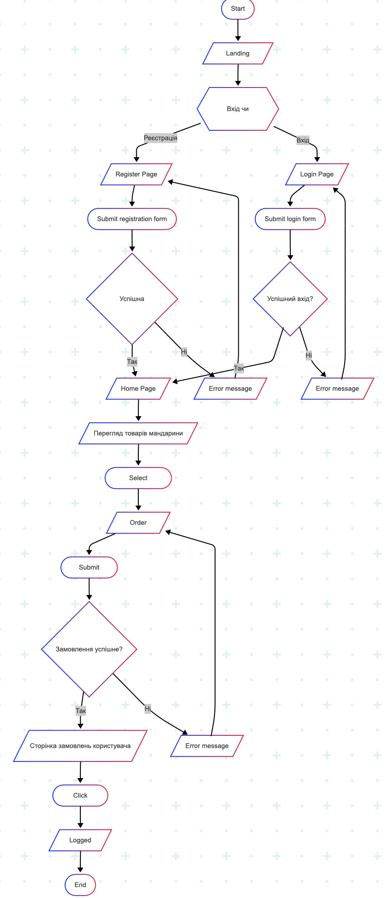
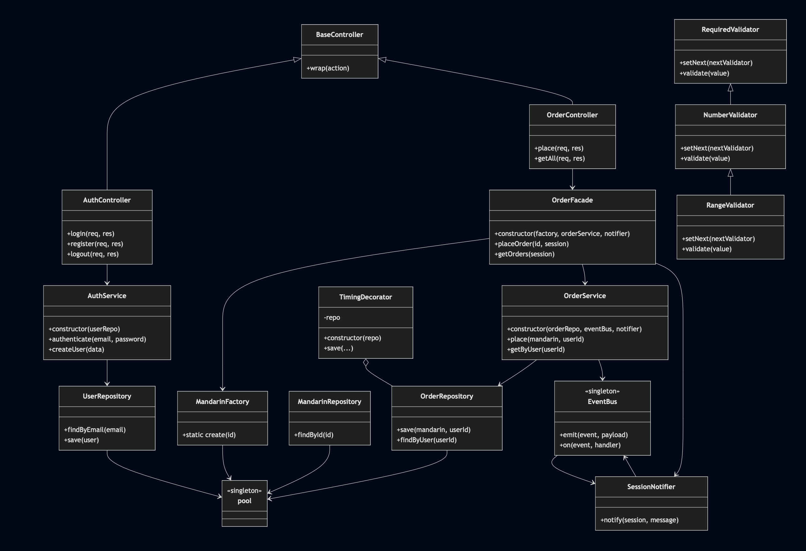

### UML-діаграми



### 1. Factory Method
#### Визначення:
Патерн, який інкапсулює процес створення об’єктів, приховуючи від клієнта деталі ініціалізації.

#### Проблема «до»:
Контролери писали власні SQL-запити та конструювали моделі в різних місцях:

```
original/controllers/orderController.js
```
```
const [row] = await db.execute('SELECT * FROM mandarins WHERE id=?', [id]);
const mandarin = new Mandarin(row);
```
#### Чому:

Відокремлює “отримати дані” від “створити об’єкт”

Централізує логіку конструювання (доповнення властивостей, перевірки, кешування)

#### Шлях у проєкті:
```
refactored/src/factories/MandarinFactory.js
```
#### Приклад «після»:
```
class MandarinFactory {
  static async create(id) {
    const [rows] = await pool.execute(
      'SELECT * FROM mandarins WHERE id = ?', [id]
    );
    return rows[0] ? new Mandarin(rows[0]) : null;
  }
}
```
### 2. Repository Pattern
#### Визначення:
Виділяє шар доступу до даних, інкапсулюючи всі SQL-запити в окремі класи.

#### Проблема «до»:
SQL-коди були розсіяні по моделях і контролерах, змішувалися з бізнес-логікою.

#### Чому:

Створює чіткий інтерфейс CRUD-операцій

Дозволяє змінювати схему БД без правки бізнес-шару

Полегшує мокування в тестах

#### Шляхи в проєкті:
```
refactored/src/repositories/UserRepository.js

refactored/src/repositories/MandarinRepository.js

refactored/src/repositories/OrderRepository.js
```
#### Приклад «після»:

```
class OrderRepository {
  async save(mandarin, userId) { /* ... */ }
  async findByUser(userId) { /* ... */ }
}
```
### 3. Strategy Pattern
#### Визначення:
Інкапсулює алгоритми в окремі класи, роблячи їх взаємозамінними.

#### Проблема «до»:
Повідомлення користувачу (нотифікація) було закодоване безпосередньо в сервісі.

#### Чому:

Дозволяє легко міняти спосіб нотифікації (сесія, email, SMS)

Відокремлює бізнес-логіку від реалізації повідомлень

#### Шлях у проєкті:
```
refactored/src/strategies/SessionNotifier.js
```
#### Код:

```
class SessionNotifier {
  notify(session, message) {
    session.lastMessage = message;
  }
}
```
### 4. Observer (Event Bus)
#### Визначення:
Дозволяє відокремити генерування подій від обробників, які на них реагують.

#### Проблема «до»:
Розширення функціоналу (логування, аналітика) вбудовувалося прямо в сервіси.

#### Чому:

Дозволяє додавати/змінювати реакції на події без правки основного коду

Підтримує множественність підписників

#### Шлях у проєкті:
```
refactored/src/events/EventBus.js
```
#### Код:

```
const EventEmitter = require('events');
module.exports = new EventEmitter();
```

### 5. Decorator Pattern
#### Визначення:
Динамічно додає об’єкту нову поведінку, обгортаючи його в «декоратор».

#### Проблема «до»:
Хотілося вимірювати час виконання методів репозиторію, не змінюючи сам клас OrderRepository.

#### Чому:

Дозволяє додати логування часу без зміни оригінального коду

Можна підключити чи відключити за потребою

#### Шлях у проєкті:
```
refactored/src/decorators/TimingDecorator.js
```
#### Код:

```
class TimingDecorator {
  constructor(repo) { this.repo = repo; }
  async save(...args) {
    console.time('OrderRepo.save');
    const res = await this.repo.save(...args);
    console.timeEnd('OrderRepo.save');
    return res;
  }
}
```
### 6. Singleton
#### Визначення:
Гарантує існування лише одного екземпляра об’єкта по всьому додатку.

#### Проблема «до»:
Кожний модуль створював новий пул підключень до MySQL.

#### Чому:

Єдина точка конфігурації та управління підключеннями

Зменшує кількість одночасних кон­не­к­шенів

#### Шлях у проєкті:
```
refactored/src/db.js
```
#### Код:

```
const pool = mysql.createPool({ /*…*/ });
module.exports = pool;
```
### 7. Dependency Injection
#### Визначення:
Механізм передачі залежностей (репозиторіїв, сервісів) зверху, замість жорсткого імпорту.

#### Проблема «до»:
Контролери/сервіси самостійно імпортували свої залежності, ускладнюючи тестування.

#### Чому:

Дозволяє заміняти реалізації (моки) у тестах

Спрощує конфігурацію, збираючи всі залежності в одному місці

#### Шлях у проєкті:
```
refactored/src/container.js
```
#### Фрагмент:

```
const userRepo = new UserRepository();
const authService = new AuthService(userRepo);
module.exports = { authService, /*…*/ };
```
### 8. Template Method
#### Визначення:
Визначає «скелет» алгоритму в базовому класі, делегуючи деякі кроки підкласам.

#### Проблема «до»:
У кожному контролері дублювався блок try/catch → запис помилки в сесію → редірект.

#### Чому:

Інкапсулює спільну обробку помилок

Контролери містять тільки специфічну логіку, без boilerplate

#### Шлях у проєкті:
```
refactored/src/controllers/BaseController.js
```
#### Код:

```
class BaseController {
  wrap(action) {
    return async (req, res, next) => {
      try { await action(req, res, next); }
      catch (e) {
        req.session.lastMessage = e.message;
        res.redirect('/');
      }
    };
  }
}
```
### 9. Facade Pattern
#### Визначення:
Надає спрощений інтерфейс для складної підсистеми.

#### Проблема «до»:
Контролери напряму спілкувалися з фабрикою, сервісом і нотифікатором, що ускладнювало код.

#### Чому:

Приховує внутрішню кінцеву послідовність кроків

Контролер викликає тільки один метод (placeOrder, getOrders)

#### Шлях у проєкті:
```
refactored/src/facades/OrderFacade.js
```
#### Код:

```
class OrderFacade {
  async placeOrder(id, session) {
    const mand = await this.factory.create(id);
    if (!mand) throw new Error('Not found');
    return this.orderService.place(mand, session.userId);
  }
  async getOrders(session) { /*…*/ }
}
```
### 10. Chain of Responsibility
#### Визначення:
Передає запит уздовж ланцюжка обробників, поки один з них не обробить його.

#### Проблема «до»:
Валідація полягала в одному монолітному блоці (перевірка на порожнє, число, діапазон).

#### Чому:

Кожен валідатор відповідає за одну перевірку

Легко додавати/видаляти/переставляти кроки валідації

#### Шляхи в проєкті:
```
refactored/src/validators/RequiredValidator.js

refactored/src/validators/NumberValidator.js

refactored/src/validators/RangeValidator.js
```
#### Фрагмент (RequiredValidator → NumberValidator → RangeValidator):

```
const required = new RequiredValidator();
required
  .setNext(new NumberValidator())
  .setNext(new RangeValidator(mandarinRepo));
```
